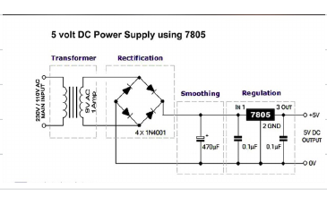
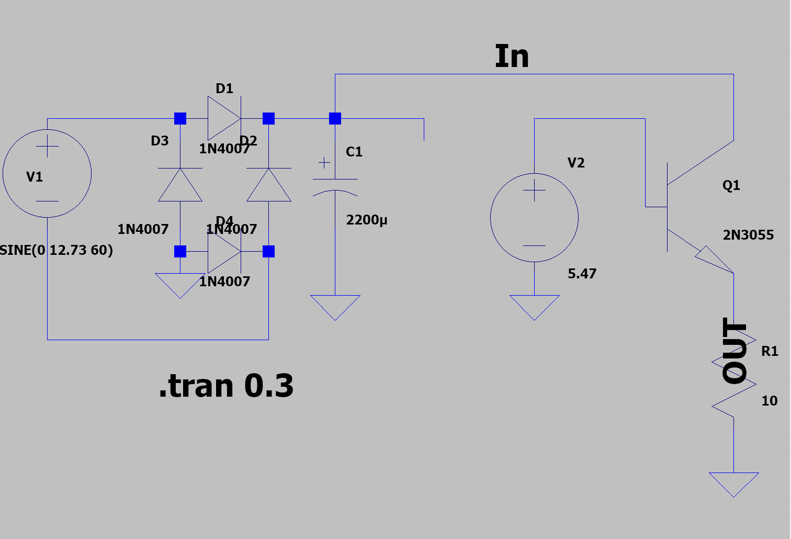
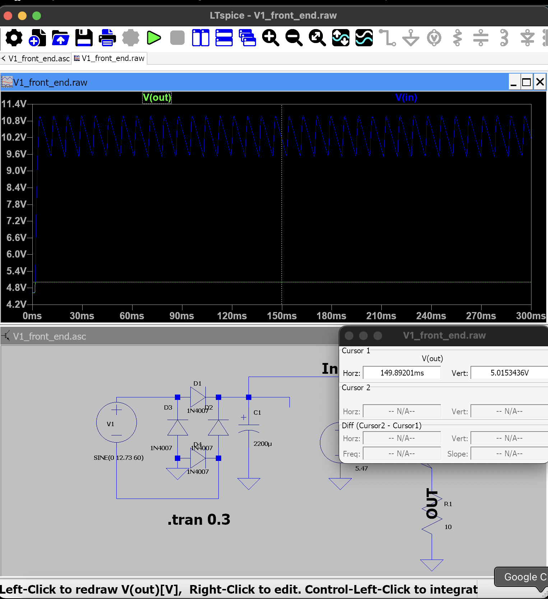
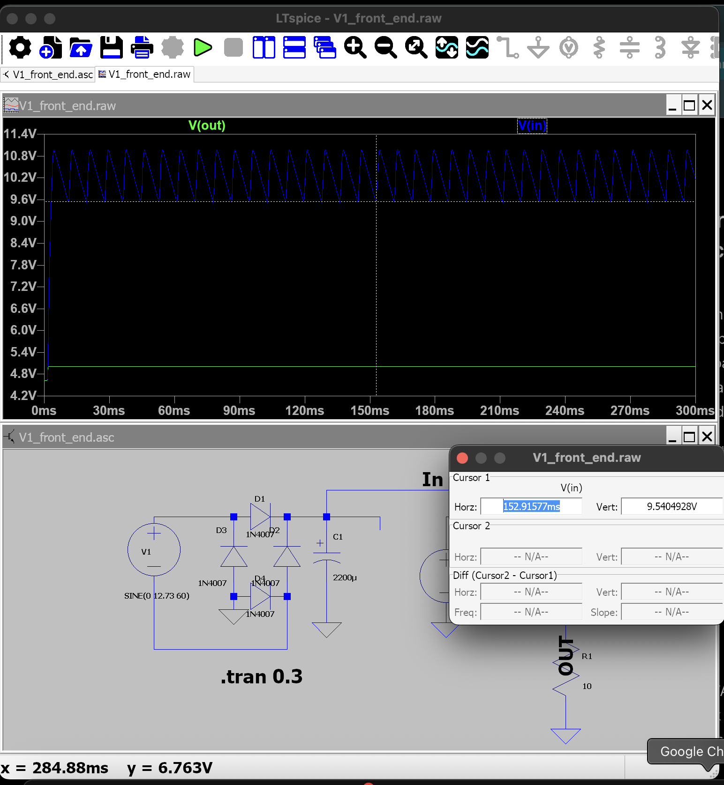
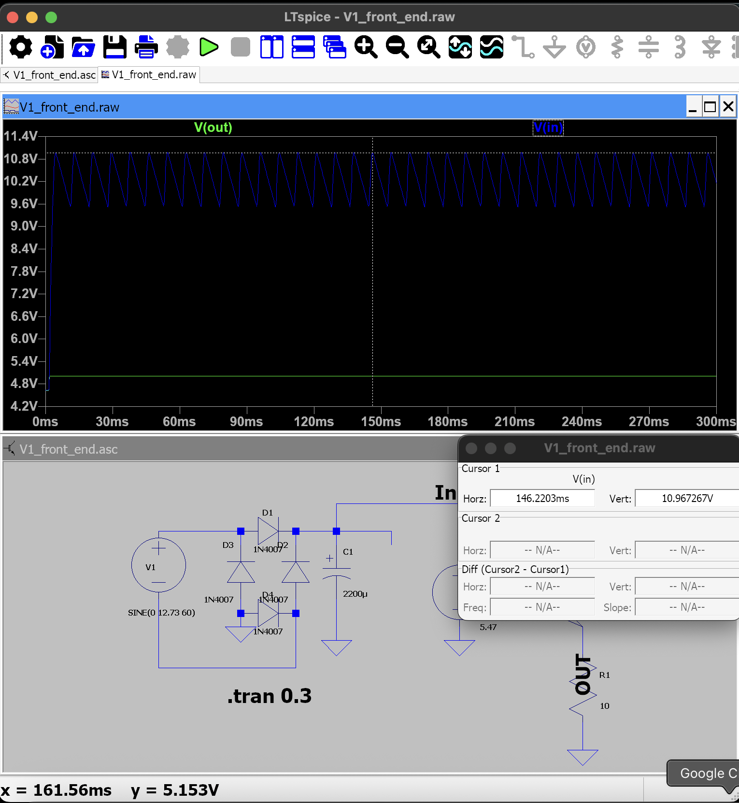

# V1 7805 Power Supply - LTspice Work (10/7/26)

This is what I worked on today for V1 of my power supply project. I wanted to understand the front end before I build it for real instead of just copying the circuit and hoping it works.

I am still early in Circuits I and a lot of this was new to me, especially RMS vs peak, ripple, dropout, and how the bridge rectifier actually charges the capacitor.

## What I did

- converted the 9 VAC source from RMS to peak
- worked through the bridge rectifier and diode drops
- calculated the expected ripple with a 2200 uF filter capacitor
- checked whether the 7805 should still have enough voltage at the bottom of the ripple
- figured out the correct load for 5 V at 500 mA
- built the circuit in LTspice
- compared my hand calculations to LTspice
- caught a few mistakes and kept them in the notes instead of hiding them
- reran the final version with D1-D4 explicitly set to the LTspice `1N4007` model

## Circuit I am working toward

```text
9 VAC, 60 Hz
    |
    v
4x 1N4007 bridge rectifier
    |
    v
2200 uF smoothing capacitor
    |
    v
7805 regulator
(2N3055 stand-in in today's LTspice run)
    |
    v
5 V output, about 500 mA max for V1 testing
```

Reference circuit from my notebook:



## Hand calculations

### 9 VAC RMS to peak

```text
Vpeak = Vrms * sqrt(2)
      = 9 * sqrt(2)
      = 12.73 V
```

### Peak after the bridge

I started with about 0.8 V per diode. Two diodes conduct at a time.

```text
Vrect_peak ~= 12.73 - 2(0.8)
           ~= 11.13 V
```

### Ripple estimate

For 500 mA, 60 Hz, and 2200 uF:

```text
Delta V ~= I / (2 f C)
        ~= 0.5 / (2 * 60 * 0.0022)
        ~= 1.89 Vpp
```

The final LTspice ripple came out lower than this. The simple equation is only an approximation of the capacitor discharge interval. In the simulation the diodes start conducting again before a full 8.33 ms half-cycle has passed.

### Why I picked 2200 uF

I am using about 7 V as the minimum input target for the 7805 so there is still headroom above the 5 V output.

For a 10% low AC source:

```text
9 VAC -> 8.1 VAC
8.1 * sqrt(2) = 11.46 V peak
11.46 - 1.6 V diode drops = 9.86 V
9.86 - 7.0 = 2.86 V allowable ripple

C >= I / (2 f DeltaV)
C >= 0.5 / (2 * 60 * 2.86)
C >= 1459 uF
```

I picked 2200 uF / 25 V. Even at -20% capacitance it would be about 1760 uF, which is still above the calculated minimum.

### 500 mA load

The real load belongs on the regulated 5 V output.

```text
R = V / I
  = 5 / 0.5
  = 10 ohm

P = I^2 R
  = 0.5^2 * 10
  = 2.5 W
```

## LTspice results

The verified LTspice file is included as [`V1_front_end.asc`](V1_front_end.asc).

The final run has:

```text
D1-D4 = 1N4007
C1 = 2200 uF
Q1 = 2N3055 stand-in
V2 = 5.47 V
R1 = 10 ohm
.tran 0.3
```

### Final 1N4007 run

| Item | CALCULATED | LTSPICE | MEASURED |
|---|---:|---:|---:|
| Rail peak | 11.13 V | 10.967 V | not yet |
| Rail valley | 9.23 V | 9.540 V | not yet |
| Rail ripple | 1.89 Vpp | 1.427 Vpp | not yet |
| Vout | 5.00 V | 5.0153 V | not yet |
| Regulator heat | 2.59 W | 2.63 W | not yet |

The cursor screenshots are also saved. For the final valley check I moved the cursor onto the actual low point and got 9.5404928 V at 152.91577 ms, which rounds to 9.540 V in the table.









## Earlier default-diode run

Before I explicitly set D1-D4 to `1N4007`, I had an earlier run with the generic/default diode setup. Those results were slightly different:

```text
Rail peak   11.068 V
Rail valley  9.626 V
Ripple       1.443 Vpp
Vout         5.015 V
Heat         2.67 W
```

I kept the old screenshots because they show the progression, but images 11-15 are labeled `DEFAULT_DIODE` now so I do not accidentally treat them as the final run.

This was actually useful because it showed me that the model I choose matters. The circuit looked basically the same, but the diode model changed the rail numbers a little.

## One mistake I made with the load

At first I had a 20 ohm load on the unregulated rail because that rail is around 10 V, so 20 ohm gives about 0.5 A.

Then I realized that is not where the real load belongs. The load should be on the regulator output. Since the regulated output is 5 V, the correct 500 mA load is 10 ohm.

I kept that old screenshot too and labeled it `05_EARLY_RUN_20ohm_rail_load.png` so it is obvious that it was not the final circuit.

## 7805 problem in LTspice

I searched `7805` expecting the normal linear regulator and found `LTC7805`, which is a completely different switching controller.

I stopped using it and made a temporary 2N3055 emitter-follower stand-in so I could keep learning the rectifier/filter side without pretending I had a real 7805 model.

My first guess was:

```text
Vout ~= Vref - VBE
5.8 - 0.8 ~= 5.0 V
```

The transistor model did not have a 0.8 V VBE at this operating point, so I adjusted the reference to about 5.47 V and ended up with about 5.015 V out.

The stand-in is only there to keep the simulation moving. It does not prove the real 7805 ripple rejection, dropout, current limit, or thermal behavior.

## What I learned today

The biggest thing that clicked was ripple. The capacitor charges near the rectified peaks and then feeds the load while the source voltage falls below the capacitor voltage.

I also learned to stop trusting a part just because the name looks right. The LTC7805 mistake and the diode-model difference both came from the same basic lesson: check the exact part/model instead of assuming.

The other useful thing was seeing that calculations and simulation do not have to match perfectly to still be useful. The hand calculation gives me an expectation. LTspice gives me a better model. The physical circuit will be the next comparison.

## Limits of today's simulation

The 2N3055 is not a 7805 model, so I am not using today's simulated 5 V output as proof that V1 meets the final ripple or regulation requirements.

The actual L7805CV, real adapter, real 1N4007s, capacitor tolerance, wiring, and temperature will all affect the physical result.

## Files

```text
README.md
V1_front_end.asc
session-log.md
engineering-notes.md
handwritten-notes-transcription.md
TODO-next-session.md
images/
source/
```

The handwritten notebook is kept in `source/`, and the typed transcription is included so I can search the notes later. Pages that show the older/default-diode LTspice values are left as-is because that is what I actually wrote at the time.

## Next step

When the 9 VAC adapter arrives, the next thing I am doing is measuring its no-load AC output before I connect it to the rest of the circuit.

After that I will build and test the real supply one stage at a time:

```text
adapter
-> bridge
-> bridge + capacitor
-> 7805
-> load
```
