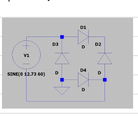
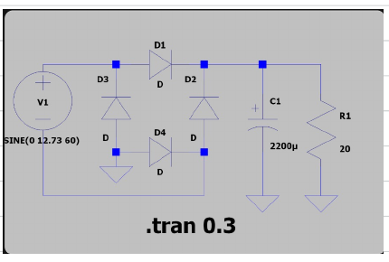
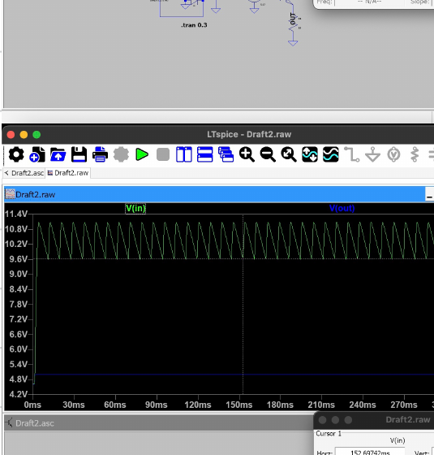
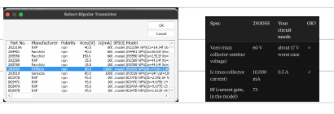

> **Note:** The handwritten pages show the work exactly as I did it during the session. Some of the LTspice numbers in the notebook are from the earlier default-diode run. The final explicit `1N4007` results are in `README.md`, `session-log.md`, and the final screenshots.

# Typed Version of My Handwritten Notes

**Date:** 2026-10-07  
**Revision:** V1 - 7805 linear supply  
**What I was working on:** front-end calculations + LTspice

This is not meant to be a polished report. It is just a typed/searchable version of what I worked through in my notebook, including the parts I changed later.

## Basic formulas I used

```text
V = IR
P = IV
Vpeak = Vrms * sqrt(2)
DeltaV ~= I / (2fC)
Pheat = (Vin - Vout) * I
```

I learned that RMS is the normal AC value used for power calculations, while peak voltage matters when I am checking things like the maximum capacitor voltage.

## 1. 9 VAC source

The adapter is rated 9 VAC RMS at 60 Hz.

```text
Vpeak = 9 * sqrt(2)
      = 12.7279 V
```

So in LTspice I used a sine source with about 12.73 V peak.

## 2. Bridge rectifier

The bridge uses four diodes, but current goes through two of them at a time.

That means my first estimate after the bridge was:

```text
Vrect_peak ~= Vpeak - 2VD
```

Using about 0.8 V per diode:

```text
Vrect_peak ~= 12.73 - 1.6
           ~= 11.13 V
```



## 3. Capacitor and ripple

The bridge output is not flat DC. The capacitor charges near the peaks and then feeds the load in between them.

For a full-wave rectifier at 60 Hz, I used:

```text
DeltaV ~= I / (2fC)
```

At 500 mA with 2200 uF:

```text
DeltaV ~= 0.5 / (2 * 60 * 0.0022)
        ~= 1.89 Vpp
```

To pick the capacitor, I wanted the 7805 input to stay above about 7 V.

For a 10% low source:

```text
9 VAC -> 8.1 VAC
8.1 * sqrt(2) = 11.46 V peak
11.46 - 1.6 = 9.86 V after the bridge
9.86 - 7.0 = 2.86 V ripple allowed before hitting 7 V

C >= 0.5 / (2 * 60 * 2.86)
C >= 1459 uF
```

I chose 2200 uF / 25 V.

Even if the capacitor is -20% from nominal:

```text
2200 uF * 0.8 = 1760 uF
```

That is still above 1459 uF.

## 4. My load mistake and correction

At first I was looking at the raw rail around 10 V and wanted about 0.5 A, so I did:

```text
R = 10 / 0.5 = 20 ohm
```

That was fine for an early front-end-only test, but it was not the correct final load location.

The real load belongs after the 5 V regulator, so:

```text
R = 5 / 0.5 = 10 ohm
```

At 500 mA the load resistor dissipates:

```text
P = I^2R
  = 0.5^2 * 10
  = 2.5 W
```

That is why I bought higher-power 10 ohm resistors instead of using normal little resistors.

## 5. Rectifier/filter simulation

The final run I used for today's session log gave:

```text
Rail peak   = 11.068 V
Rail valley = 9.626 V
Ripple      = 1.443 Vpp
```

My hand calculations were:

```text
Rail peak   = 11.13 V
Rail valley = 9.23 V
Ripple      = 1.89 Vpp
```

Comparison:

| Item | Hand calc | LTspice | Difference |
|---|---:|---:|---:|
| Rail peak | 11.13 V | 11.068 V | -0.6% |
| Rail valley | 9.23 V | 9.626 V | +4.3% |
| Ripple | 1.89 Vpp | 1.443 Vpp | -24% |





The ripple was the biggest difference. My current explanation is that the simple equation does not model the exact conduction interval. In LTspice the source catches back up to the capacitor and the diodes start conducting again before a full 8.33 ms half-cycle passes.

## 6. Dropout margin

Using about 7 V as the minimum input target for the future 7805 stage:

```text
9.626 - 7.0 = 2.626 V margin
```

So the final simulated valley was still comfortably above that target.

## 7. What the LTspice diode model was doing

The source peak was 12.73 V and the rectified peak was about 11.07 V.

```text
VD ~= (12.73 - 11.07) / 2
   ~= 0.83 V per conducting diode
```

That was pretty close to my original 0.8 V assumption.

The real 1N4007s can still be different, so I want to compare this with the datasheet and then the real circuit later.

## 8. 2N3055 stand-in

I searched `7805` in LTspice and got `LTC7805`. I originally thought that was the part I wanted, but it is not the normal 7805 linear regulator.

So I used a 2N3055 emitter follower as a temporary stand-in.



My first thought was:

```text
Vout ~= Vref - VBE
```

I tried:

```text
Vref = 5.8 V
VBE ~= 0.8 V
Vout ~= 5.0 V
```

The model's VBE was lower than that, so the output came out too high. I adjusted Vref to about 5.47 V and ended up near 5.015 V.

I also estimated the transistor base current using a beta around 73:

```text
IB ~= IC / beta
   ~= 0.5 / 73
   ~= 6.8 mA
```

## 9. Final simulated values

```text
Vin peak    = 11.0681 V
Vin valley  = 9.6255 V
Vout        = 5.0152 V
Rail ripple = 1.443 Vpp
Rail avg    = 10.347 V
Load current = 0.5015 A
```

Estimated power being burned by the stand-in regulator:

```text
P ~= (Vin(avg) - Vout) * I
  ~= (10.347 - 5.0152) * 0.5015
  ~= 2.67 W
```

My hand estimate was about 2.59 W.


## 10. Important limitation

The 2N3055 is not a real 7805 model. I am only using it as a temporary stand-in so I can work through the circuit.

It does not prove:

- the real 7805 output ripple
- the real dropout behavior
- the real current limiting
- the real thermal behavior

Those need the actual L7805CV datasheet and then the physical circuit.

## Main things I learned today

- Convert RMS to peak before estimating the capacitor voltage.
- Two diodes conduct at a time in a bridge rectifier.
- The smoothing capacitor charges near the peaks and feeds the load between them.
- Pick components from requirements instead of just choosing random values.
- Put the load where it will actually be in the real circuit.
- A transistor's VBE is not always exactly 0.7 or 0.8 V.
- Check the exact part number before using something in LTspice.
- Simulation helps, but the real circuit is still the final test.
